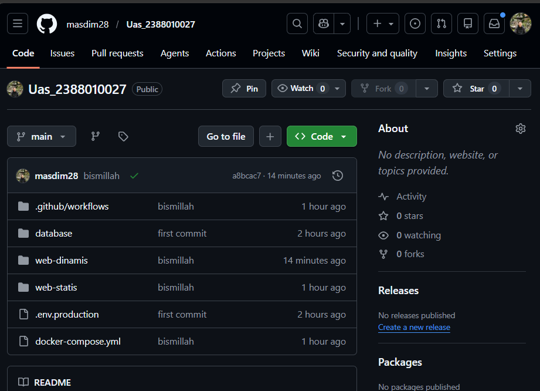
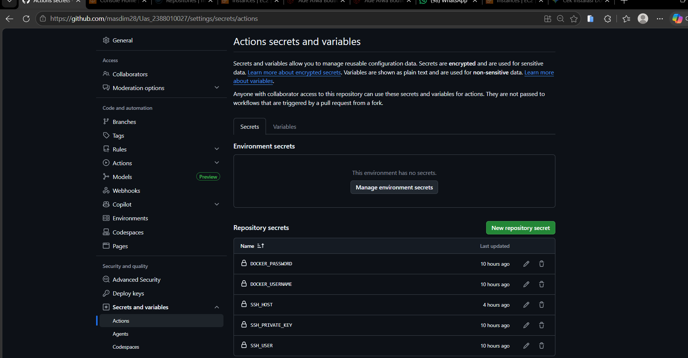
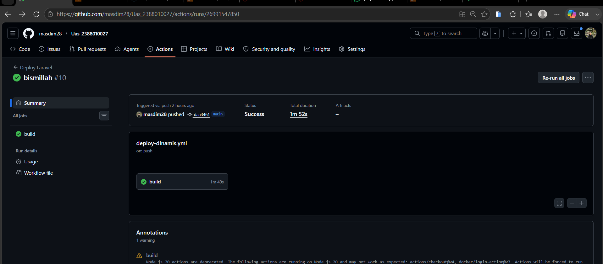
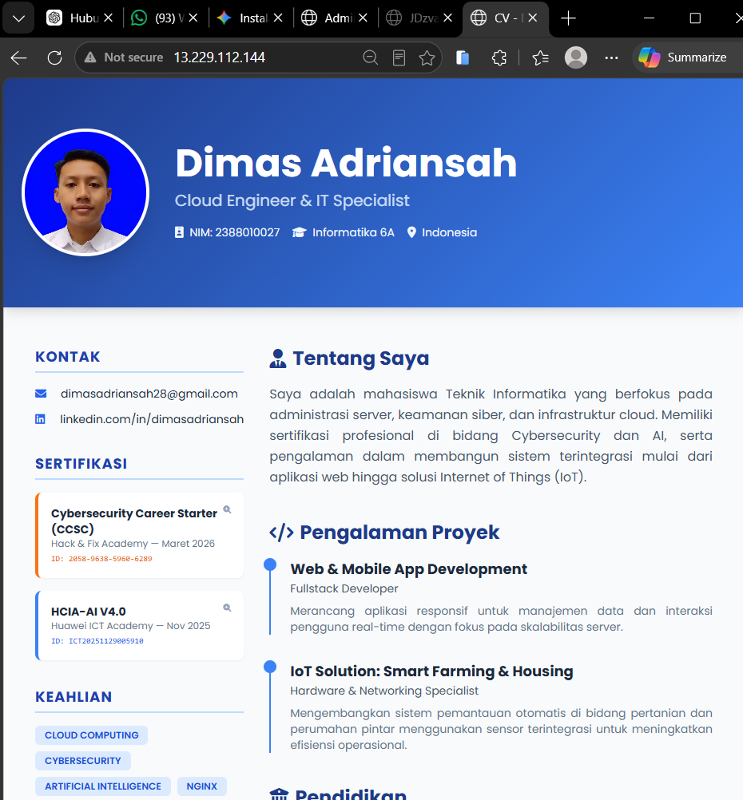
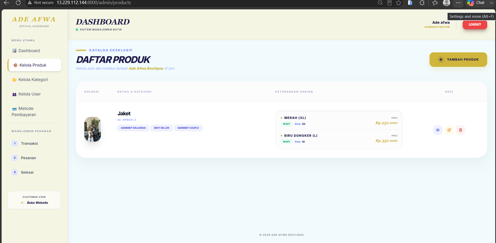
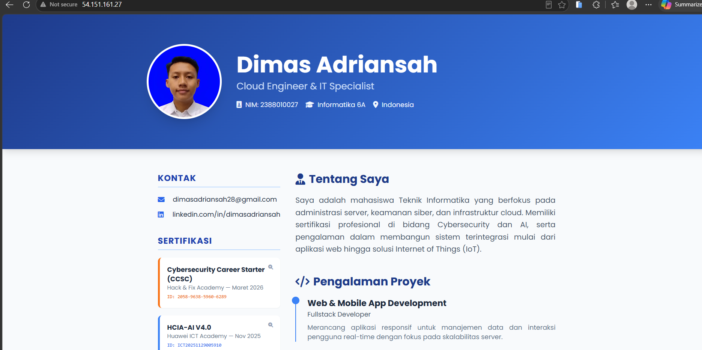
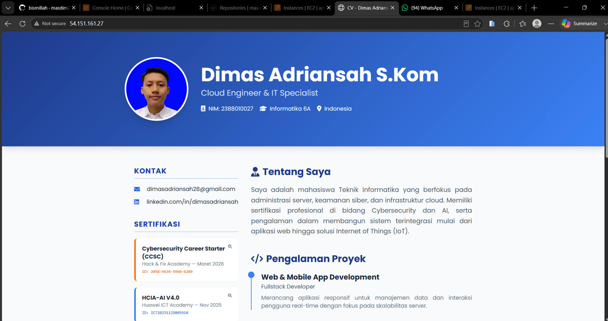

Tahapan Implementasi CI/CD Website Statis dan Dinamis Menggunakan GitHub Actions, Docker Hub, dan AWS EC2

1. Membuat Repository GitHub
   Kegiatan
   Membuat repository GitHub.
   Membuat folder:
   web-statis
   web-dinamis
   .github/workflows
   
   Tampilan repository GitHub.

Terlihat folder:

web-statis
web-dinamis
.github

2. siapkan website dinamis dan statisnya
3. Membuat Akun dan Repository Docker Hub
   
4. Membuat Workflow GitHub Actions
   Membuat:

deploy-statis.yml
deploy-dinamis.yml

5. Menambahkan GitHub Secrets
   
6. Membuat Instance AWS EC2
   Kegiatan
   Membuat instance Ubuntu.
   Membuka port:
   22
   80
   8000
   
7. Menginstal Docker dan Docker Compose pada EC2
   Kegiatan

Instal:

Docker Engine
Docker Compose
sudo apt-get update
sudo apt-get install -y ca-certificates curl gnupg
sudo install -m 0755 -d /etc/apt/keyrings
curl -fsSL https://download.docker.com/linux/ubuntu/gpg | sudo gpg --dearmor -o /etc/apt/keyrings/docker.gpg
sudo chmod a+r /etc/apt/keyrings/docker.gpg
echo
"deb [arch=$(dpkg --print-architecture) signed-by=/etc/apt/keyrings/docker.gpg] https://download.docker.com/linux/ubuntu
$(. /etc/os-release && echo "$VERSION_CODENAME") stable" |
sudo tee /etc/apt/sources.list.p/docker.list > /dev/null

sudo apt-get update

sudo apt-get install -y docker-ce docker-ce-cli containerd.io docker-buildx-plugin docker-compose-plugin

8. Membuat docker-compose.yml
   Menghubungkan:

Laravel
MariaDB
Website statis dan dinamis

9. Build dan Push Docker Image Otomatis
   
10. cek ip port 80
    
11. cek ip port 8000
    
12. login ke admin untuk mengecek dan uplode produk baru
    
13. cek bagian user apakah sudah berubah dan ada produk baru yg muncul
    

14. tes perubhan ketika web statis di rubah otomatis deploy ke server aws

    

15. setelah push maka otomatis deploy dan otomatis berubah
16. 

17. Alhamdulillah Berhasi
